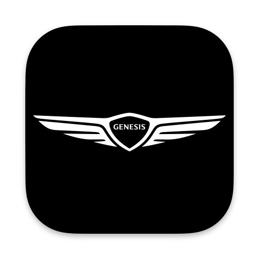

# Major Hub
## A desktop application to control your Genesis vehicle

Hello! I am currently writing an Electron application to control Genesis vehicles. This application uses [Bluelinky](https://github.com/Hacksore/bluelinky) to interface with Genesis Connected Services.

Created using Electron Forge, Webpack, and React.

**More to come!**